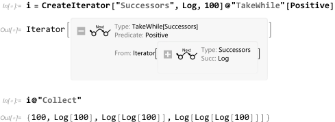

# ``LazyList` ``

*LazyList* is a Wolfram language package for lazy evaluation of lists, including an extensible iterator framework and a lazy range representation.

## Installation

*LazyList* package requires Wolfram language version 12 or later.

For prerelease version, for example, evaluate `PacletInstall["https://github.com/miRoox/LazyList/releases/download/v0.1.0/LazyList-0.1.0.paclet"]` in Mathematica.

## Usage

Basic usage:

